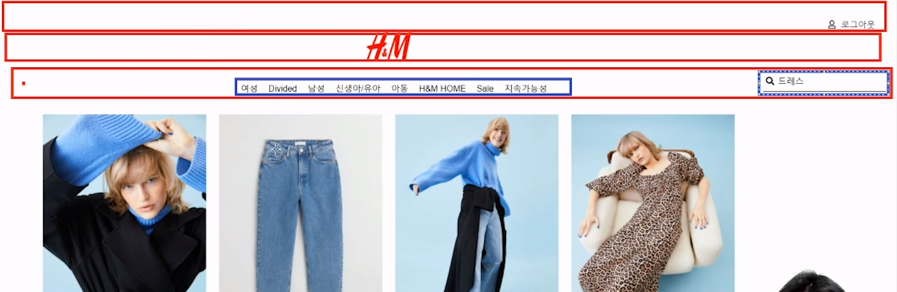

# 쇼핑몰 웹사이트

This project was bootstrapped with [Create React App](https://github.com/facebook/create-react-app).

* https://codingnoona.thinkific.com/courses/take/3/lessons/33879741-1

## 프로젝트 설치

// 프로젝트 생성 
npx create-react-app <폴더명>

// 의존성 
npm install react-router-dom@6

* fontawsome react  
https://fontawesome.com/v5/docs/web/use-with/react

npm i --save @fortawesome/fontawesome-svg-core  
npm install --save @fortawesome/free-solid-svg-icons  
npm install --save @fortawesome/free-regular-svg-icons  
npm install --save @fortawesome/react-fontawesome

* json-server  
https://www.npmjs.com/package/json-server

npm install -g json-server

products.json  
https://gist.github.com/legobitna/24cf11ae95d53c9cdcdc7b0040f059e9  
https://my-json-server.typicode.com/legobitna/hnm-react-router/products

json-server --watch products.json --port 5000

* My Json Server  
https://my-json-server.typicode.com/

* react-bootstrap

npm install react-bootstrap bootstrap
npm install react-bootstrap bootstrap@5.1.3

## 프로젝트 설명 

* 데모:
https://noona-hnm.netlify.app/
* 전체소스:
https://github.com/legobitna/hnm-react-router

1. 전체 상품페이지, 로그인, 상품상세페이지
2. 전체 상품페이지에서는 전체 상품을 볼 수 있다.
3. 로그인 버튼을 누르면 로그인 페이지가 나온다.
4. 상품 디테일을 눌렀으나, 로그인 안 되어있을 경우에는 로그인 페이지가 먼저 나온다.
5. 로그아웃 버튼을 클릭하면 로그아웃이 된다.
6. 다시 로그인 페이지가 보인다.
7. 로그인을 하면 로그아웃이 보이고 로그아웃을 하면 로그인이 보인다.

## Available Scripts

In the project directory, you can run:

### `npm start`

Runs the app in the development mode.\
Open [http://localhost:3000](http://localhost:3000) to view it in your browser.

## 레이아웃

### 상단

### detail 페이지

### state

